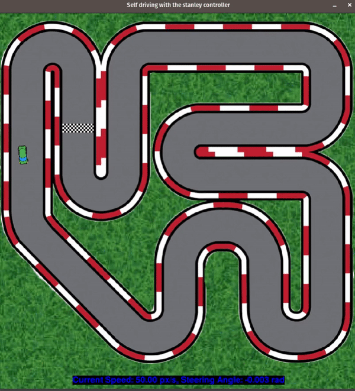

# The Self Driving project
Testing control algorithms on a simulated car.  
Readability is valued over efficiency.  

## Examples

### 1. Driving with the Pure-Pursuit controller
  

### 2. Driving with the Stanley controller
  

## Deps
- Pygame == 1.9.6
- Numpy == 1.22.3
(may work on other versions)
